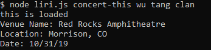

# liri

This is a command line interface program that runs with node.js; which will console out different information dependent on what is entered. For example, if you type `node liri.js movie-this '<movie name here>'` it will tell you the following information: 

* Title of the movie.
* Year the movie came out.
* IMDB Rating of the movie.
* Rotten Tomatoes Rating of the movie.
* Country where the movie was produced.
* Language of the movie.
* Plot of the movie.
* Actors in the movie.
  
below are commands and a few screenshots of what the ouput of those commands are with liri:

*  `node liri.js concert-this <artist/band name here>`

*  `node liri.js spotify-this-song '<song name here>'`

*  `node liri.js movie-this '<movie name here>'`

*  `node liri.js do-what-it-says`

do what it says takes the command within random.txt and outputs the data to the command line interface. 

## Usage

This project was completed using Javascript, and can be ran with node.js

## Contributing
Pull requests are welcome. For major changes, please open an issue first to discuss what you would like to change.

Please make sure to update tests as appropriate.

## License

created by kima111